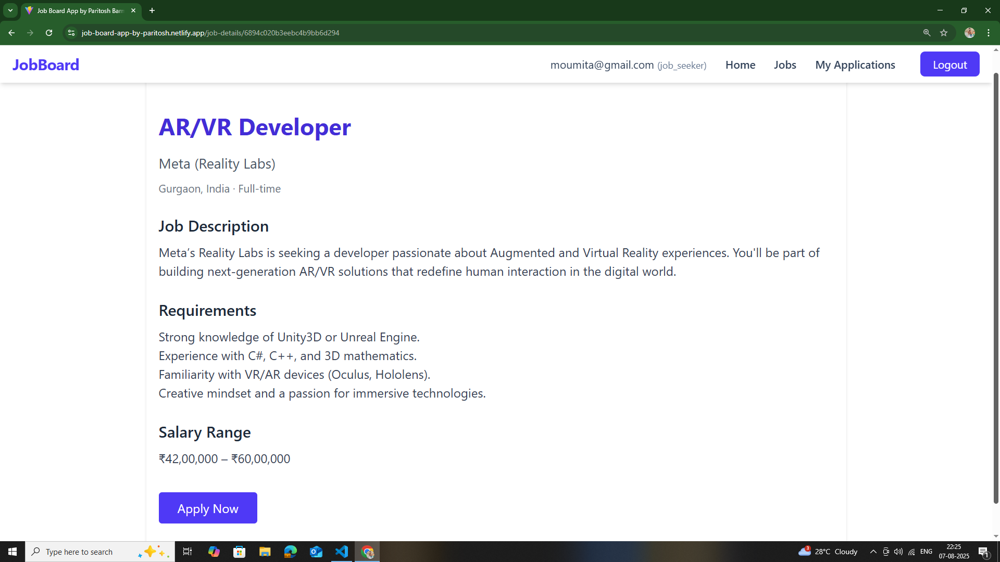
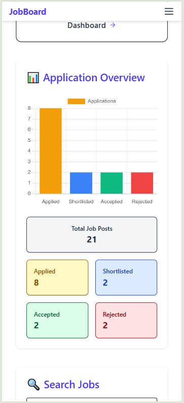
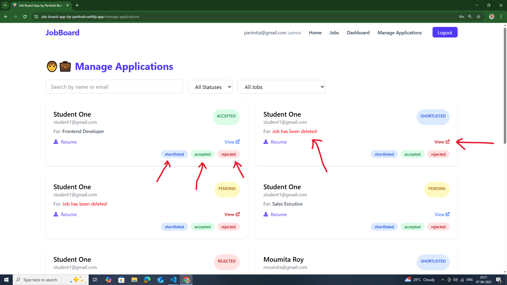

# 💼 Job Board App

A **Full-Stack Job Board Application** developed by **Paritosh Barman** that connects **Job Seekers**, **Recruiters**, and **Admin** in a role-based environment.  
Built with **React.js + TailwindCSS** for the frontend, **Node.js + Express.js** for the backend, and **MongoDB** for persistent storage.

---
 🌐 **Live Demo:** [Job Board App](https://job-board-app-by-paritosh.netlify.app/)
---
## 🔗 Links

- 🌐 **Live Demo:** [Job Board App](https://job-board-app-by-paritosh.netlify.app/)
- 📂 **GitHub Repository:** [GitHub - Job Board App](https://github.com/ParitoshBarman/Job-Board-App)
- 💻 **Frontend Link:** [Frontend](https://job-board-app-by-paritosh.netlify.app/)
- 🛠 **Backend API:** [Backend API](https://job-board-app-cct1.onrender.com/)

---

## 📜 Test Credentials

| Role        | Email                     | Password |
|-------------|---------------------------|----------|
| **Job Seeker** | `moumita@gmail.com`       | `123`    |
| **Recruiter**  | `parirecruiter@gmail.com` | `123`    |
| **Admin**      | `parimita@gmail.com`      | `123`    |

---

<!-- ## 🛠 Tech Stack

### **Frontend**
- React.js
- Redux Toolkit
- TailwindCSS
- Axios
- React Router DOM
- Chart.js & React-Chartjs-2
- Formik & Yup (Form Validation)
- React Hot Toast
- Framer Motion
- Lucide React Icons

### **Backend**
- Node.js
- Express.js
- MongoDB + Mongoose
- JWT Authentication
- Multer (File Uploads)
- Bcrypt.js (Password Hashing)
- CORS & Dotenv

### **Other Tools**
- Vite (Frontend Build Tool)
- Nodemon (Development)
- Git & GitHub (Version Control)
- Render (Backend Hosting)
- Netlify (Frontend Hosting) -->

## 🛠 Tech Stack

| Layer / Purpose | Technologies & Why |
|-----------------|--------------------|
| **🎨 Frontend** | ⚛ **React.js** – Component-based UI for reusability and scalability <br> 🎯 **Redux Toolkit** – Simplified global state management with less boilerplate <br> 🎨 **TailwindCSS** – Utility-first CSS for fast and responsive styling <br> 🌐 **React Router DOM** – Client-side routing with role-based access control <br> 📊 **Chart.js + React-Chartjs-2** – Data visualization for analytics dashboards <br> ✅ **Formik + Yup** – Easy and scalable form handling with validation <br> 🔔 **React Hot Toast** – Elegant toast notifications for better UX <br> 🎭 **Framer Motion** – Smooth animations and UI transitions <br> 🖼 **Lucide React Icons** – Modern and lightweight icon set |
| **⚙ Backend** | 🟢 **Node.js** – JavaScript runtime for server-side development <br> 🚀 **Express.js** – Lightweight and flexible web framework for building REST APIs <br> 🔐 **JSON Web Token (JWT)** – Secure authentication and authorization <br> 🔑 **Bcrypt.js** – Password hashing for enhanced security <br> 📂 **Multer** – File upload handling for resumes <br> 🌐 **CORS** – Enable secure cross-origin requests <br> ⚙ **Dotenv** – Manage environment variables securely |
| **🗄 Database** | 🍃 **MongoDB** – NoSQL database for flexible and scalable data storage <br> 📦 **Mongoose** – ODM for MongoDB with schema-based modeling |
| **🛠 Tools & Build** | ⚡ **Vite** – Lightning-fast frontend build tool <br> 🔄 **Nodemon** – Auto-reloads backend server during development <br> 🗂 **Git & GitHub** – Version control and collaboration <br> ☁ **Render** – Cloud hosting for backend APIs <br> ☁ **Netlify** – Cloud hosting for frontend |

---

<!-- ## ✨ Features

### **Common Features**
- Role-based Authentication (Admin, Recruiter, Job Seeker)
- Form Validation with Yup + Formik
- Toast notifications for all actions
- Responsive Design (Mobile + Desktop)

### **Job Seeker**
- Browse and filter jobs
- Apply for jobs with file upload (Resume)
- View application status with charts
- Mobile-friendly dashboard

### **Recruiter**
- Post, edit, and delete jobs
- Manage job applications
- View analytics dashboard with charts
- Responsive mobile views

### **Admin**
- Full control over all jobs and applications
- Access to analytics dashboard -->


## ✨ Features

| Category | Features |
|----------|----------|
| **🌐 Common** | 🔑 Role-based Authentication (Admin, Recruiter, Job Seeker) <br> 🛠 Role-based Rendering & Routing <br> ✅ Form Validation with Yup + Formik <br> 🔔 Toast notifications for all actions <br> 📱 Fully Responsive Design (Mobile + Desktop) |
| **👨‍💼 Job Seeker** | 🔍 Browse & filter jobs <br> 📄 Apply with resume upload <br> 📊 Track application status with charts <br> 📱 Mobile-friendly dashboard |
| **🏢 Recruiter** | ➕ Post, edit, and delete jobs <br> 📑 Manage job applications <br> 📈 View analytics dashboard with charts <br> 📱 Optimized mobile views |
| **🛡 Admin** | 🏆 Full control over all jobs and applications <br> 📊 Access complete analytics dashboard |

---

### 🔹 Additional Highlights
- 🔍 **Advanced Search** – Search with keyword, location, category, and filters (date posted, salary range, job type)  
- 📤 **File Upload Handling** – Secure resume upload & storage (Multer + MongoDB reference)  
- 📊 **Data Visualization** – Application status charts (Chart.js)  
- 🔐 **Protected Routes** – Client-side route protection with role-based access  
<!-- - ⚡ **Debounced Search** – Optimized search queries for better performance   -->
- ♻ **Persistent State** – State management via Redux Toolkit & local storage  
- 🚀 **Deployment Ready** – Backend hosted on Render, Frontend on Netlify, with environment variables for both  
- 📡 **API Integration** – Axios instance with interceptors for token handling  
<!-- - 🧪 **Testing** (optional) – Unit & integration tests with Jest/React Testing Library   -->


---

---

## 🚀 Routes Overview

### 🔐 Auth Routes
**POST** `/api/auth/login` – Login user (Admin, Recruiter, Job Seeker)  
**POST** `/api/auth/register` – Register a new user  

---

### 📄 Job Routes
**GET** `/api/jobs` – Get all jobs (Authenticated users)  
**GET** `/api/jobs/:id` – Get job details by ID (Public)  
**POST** `/api/jobs` – Create a new job (Admin, Recruiter only)  
**PUT** `/api/jobs/:id` – Update job details (Admin, Recruiter only)  
**DELETE** `/api/jobs/:id` – Delete a job (Admin, Recruiter only)  

---

### 📩 Application Routes
**POST** `/api/apply/:jobId` – Apply to a job (Job Seeker only) with resume upload  
**GET** `/api/apply/me` – Get my applications (Job Seeker only)  
**GET** `/api/apply/recruiter` – Get applications for recruiter's jobs (Recruiter only)  
**GET** `/api/apply/admin` – Get all applications (Admin only)  
**PATCH** `/api/apply/:id/status` – Update application status (Admin, Recruiter only)  
**GET** `/api/apply/:id` – Get application details (Admin, Recruiter, Job Seeker)  

---

## 🖥 Frontend Routes

**/** – Home (Protected: Admin, Recruiter, Job Seeker)  
**/jobs** – Browse jobs (Public)  
**/job-details/:id** – View job details (Public)  
**/apply/:jobId** – Apply for a job (Job Seeker)  
**/login** – Login page (Public)  
**/register** – Register page (Public)  
**/dashboard** – Dashboard with analytics (Admin, Recruiter)  
**/manage-applications** – Manage all applications (Admin, Recruiter)  
**/my-applications** – My applications list (Job Seeker)  
**/application/:id** – Application details (Admin, Recruiter, Job Seeker)  


---

## 📸 Screenshots

## **Common**
| Description | Screenshot |
|-------------|------------|
| **Login Page** - Login page for all roles |  |
| **Login Form Validation** - Validation errors in login form |  |
| **Register Page** - Register new account |  |
| **Register Form Validation** - Validation errors in register form |  |
| **Toast Notifications** - Toast messages for various actions like login, logout, update, delete, reject, shortlist, edit, save, etc. |  |

---
---

## **Job Seeker**
| Description | Screenshot |
|-------------|------------|
| **Home Page** - Job seeker dashboard with stats |  |
| **Job Search Section 2** - Job search section with filters |  |
| **Job Search with List** - Job search with job list results |  |
| **Job Listing Page** - All job listings page |  |
| **Job Details Page** - Job details information |  |
| **Apply Job Page** - Job application form |  |
| **Apply Successful Popup** - Popup after successful job application |  |
| **My Applications** - My applications list |  |
| **Application Details** - Detailed view of a job application |  |
| **Home Mobile View** - Job seeker mobile home view |  |
| **Pie Chart Mobile** - Application status pie chart on mobile |  |
| **Home Job Search Mobile** - Job search & filter section in mobile view |  |
| **Home Job List Mobile** - Job list section in mobile view |  |
| **My Applications Mobile** - My applications mobile view |  |
| **Responsive Navbar Mobile** - Responsive navbar opened in mobile view |  |

---
---
## **Recruiter**
| Description | Screenshot |
|-------------|------------|
| **Recruiter Home** - Recruiter dashboard home |  |
| **Manage Jobs Filter** - Manage jobs with filter options |  |
| **Manage Jobs List** - Job list management view |  |
| **Dashboard with Analytics** - Recruiter dashboard with charts |  |
| **Job Posting Popup** - Popup for posting new jobs |  |
| **Manage Applications Page** - Manage applications table |  |
| **Application Details & Manage** - Recruiter managing a specific application |  |
| **Job Manage Page** - All job manage page |  |
| **Edit Job Popup** - Popup form for editing job details |  |
| **Delete Job Confirmation** - Confirmation popup for job deletion |  |
| **Home Mobile** - Recruiter home page mobile view |  |
| **Home Charts Mobile** - Recruiter dashboard charts in mobile view |  |
| **Manage Applications Mobile** - Manage applications mobile view |  |
| **Application Details Mobile** - Recruiter application details mobile view |  |
| **Manage Jobs Mobile** - Manage jobs in mobile view |  |
| **Job Manage Mobile** - Job manage page mobile view |  |
| **Responsive Navbar Mobile** - Responsive navbar on mobile |  |

---
---

## **Admin**
| Description | Screenshot |
|-------------|------------|
| **Admin Dashboard - Full Access** - Admin dashboard with full control over all features |  |
| **Admin Manage Applications** - Admin managing all applications |  |

---

## 🚀 Getting Started

### 1️⃣ Clone the repository
```bash
git clone https://github.com/ParitoshBarman/Job-Board-App.git
```

### 2️⃣ Install dependencies

#### Frontend
```bash
cd frontend
npm install
```

#### Backend
```bash
cd backend
npm install
```

### 3️⃣ Environment Variables

#### Backend `.env` file
```env
PORT=5000
MONGO_URI=mongodb://localhost:27017/job-board
JWT_SECRET=your_secret_key
```

#### Frontend `.env` file
```env
VITE_BASE_URL=http://localhost:5173
VITE_API_URL=http://localhost:5000/api
VITE_API_RESUME_URL=http://localhost:5000/api
```

### 4️⃣ Run the project

#### Start Backend
```bash
cd backend
npm run dev
```

#### Start Frontend
```bash
cd frontend
npm run dev
```

---

## 📌 Project Structure
```
Job Board App
├── README.md
├── backend
│   ├── config
│   │   └── db.js
│   ├── controllers
│   │   ├── applicationController.js
│   │   ├── authController.js
│   │   └── jobController.js
│   ├── index.js
│   ├── middleware
│   │   ├── authMiddleware.js
│   │   ├── roleMiddleware.js
│   │   └── uploadMiddleware.js
│   ├── models
│   │   ├── Application.js
│   │   ├── Job.js
│   │   └── User.js
│   ├── package-lock.json
│   ├── package.json
│   ├── routes
│   │   ├── applicationRoutes.js
│   │   ├── authRoutes.js
│   │   └── jobRoutes.js
│   ├── uploads
│   │   ├── 1754453792246-ParitoshBarman-Resume.pdf
│   │   ├── 1754454183208-ParitoshBarman-Resume.pdf
│   │   ├── 1754454635090-Assignment for Internship Job Board App - Full Stack.pdf
│   │   └── 1754576881067-Assignment for Internship Job Board App - Full Stack.pdf
│   └── utils
│       └── generateToken.js
├── frontend
│   ├── README.md
│   ├── eslint.config.js
│   ├── index.html
│   ├── package-lock.json
│   ├── package.json
│   ├── public
│   │   ├── _redirects
│   │   └── vite.svg
│   ├── src
│   │   ├── App.css
│   │   ├── App.jsx
│   │   ├── assets
│   │   │   └── react.svg
│   │   ├── components
│   │   │   ├── ConfirmModal.jsx
│   │   │   ├── JobCard.jsx
│   │   │   ├── JobFormModal.jsx
│   │   │   ├── JobSkeleton.jsx
│   │   │   ├── Navbar.jsx
│   │   │   └── RoleBased.jsx
│   │   ├── index.css
│   │   ├── main.jsx
│   │   ├── pages
│   │   │   ├── ApplicationDetails.jsx
│   │   │   ├── Apply.jsx
│   │   │   ├── Dashboard.jsx
│   │   │   ├── Home.jsx
│   │   │   ├── JobDetails.jsx
│   │   │   ├── Jobs.jsx
│   │   │   ├── Login.jsx
│   │   │   ├── ManageApplications.jsx
│   │   │   ├── MyApplications.jsx
│   │   │   └── Register.jsx
│   │   ├── redux
│   │   │   ├── applicationSlice.js
│   │   │   ├── authSlice.js
│   │   │   ├── jobSlice.js
│   │   │   └── store.js
│   │   ├── routes
│   │   │   ├── ProtectedRoute.jsx
│   │   │   └── routes.jsx
│   │   └── utils
│   │       └── axios.js
│   └── vite.config.js
```
---
---
**Made with ❤️ by Paritosh Barman**
